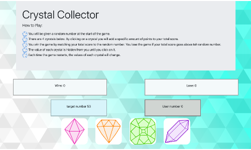

# unit-4-game
An interactive game for web browsers. Dynamically updates html with the jQuery library.

### How to Play
Click on a crystal to increase the value of your guess, try not to go over the target #.

## Built With
* [Bootstrap](https://getbootstrap.com/) - responsive framework for web
* Javascript
* JQuery
* [SVGBackgrounds](https://www.svgbackgrounds.com/) - svg background customizer

## Versioning & Author
This is the only version and is maintained by me, [sabomade](https://github.com/sabomade).

## Acknowledgements
Built & completed as part of the UCB Coding Bootcamp, Homework 4: JQuery
